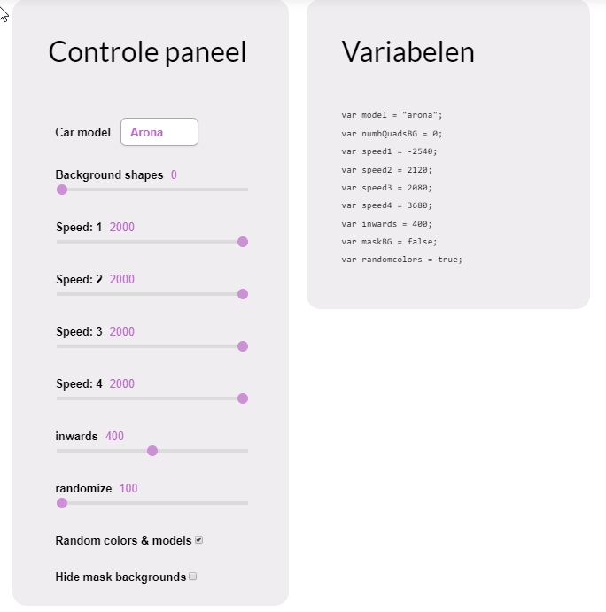

# tool-seat-generativedesign-v1
This is a proof of concept of how generative design could be implemented for online advertising. This has been made during my graduation at Greenhouse. 

It features a control panel so the user can manipulate the outcome of the visual.

### Example visuals generated by this tool

